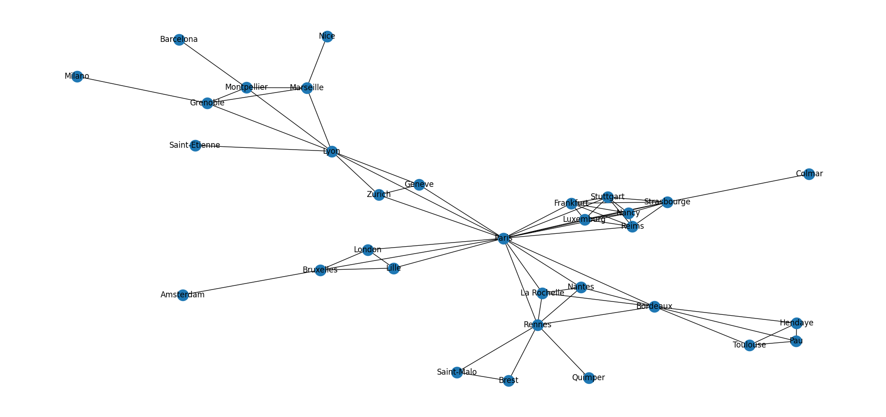
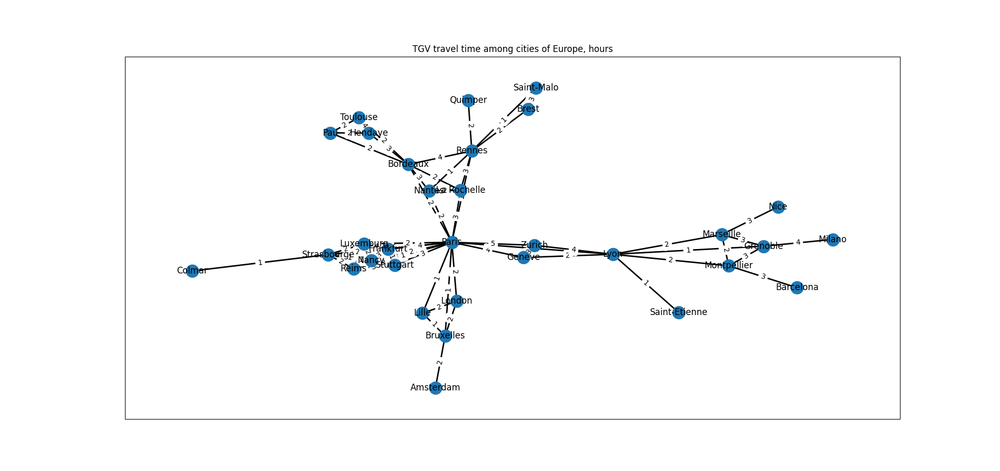

```
Vertices quantity in the graph: 32

Edges quantity in the graph: 65

Vertex Paris has degree 16
Vertex London has degree 3
Vertex Lyon has degree 7
Vertex Marseille has degree 4
Vertex Montpellier has degree 4
Vertex Barcelona has degree 1
Vertex Nice has degree 1
Vertex Grenoble has degree 4
Vertex Saint-Etienne has degree 1
Vertex Milano has degree 1
Vertex Geneve has degree 3
Vertex Zurich has degree 3
Vertex Reims has degree 6
Vertex Luxemburg has degree 6
Vertex Nancy has degree 6
Vertex Frankfurt has degree 6
Vertex Stuttgart has degree 6
Vertex Strasbourge has degree 7
Vertex Colmar has degree 1
Vertex Lille has degree 3
Vertex Bruxelles has degree 4
Vertex Amsterdam has degree 1
Vertex Rennes has degree 7
Vertex Saint-Malo has degree 2
Vertex Brest has degree 2
Vertex Quimper has degree 1
Vertex Nantes has degree 4
Vertex Bordeaux has degree 7
Vertex La Rochelle has degree 4
Vertex Toulouse has degree 3
Vertex Pau has degree 3
Vertex Hendaye has degree 3
```


```
DFS algorithm path of TGV rail roads, starting from Marseille city:

Marseille Nice Montpellier Barcelona Grenoble Milano Lyon Saint-Etienne Geneve Paris London Lille Bruxelles Amsterdam Nantes Bordeaux Rennes La Rochelle Saint-Malo Brest Quimper Hendaye Toulouse Pau Reims Strasbourge Luxemburg Nancy Frankfurt Stuttgart Colmar Zurich 

BFS algorithm path of TGV rail roads, starting from Marseille city:

Marseille Nice Montpellier Grenoble Lyon Barcelona Milano Geneve Paris Saint-Etienne Zurich Frankfurt Nancy Bruxelles La Rochelle Lille Luxemburg Stuttgart Rennes London Strasbourge Bordeaux Reims Nantes Amsterdam Brest Quimper Saint-Malo Colmar Toulouse Hendaye Pau 
```



```
Shortest paths to all destinations in the network of TGV rail roads for Marseille city:
Paris - 4 hours
London - 6 hours
Lyon - 2 hours
Marseille - 0 hours
Montpellier - 2 hours
Barcelona - 5 hours
Nice - 3 hours
Grenoble - 3 hours
Saint-Etienne - 3 hours
Milano - 7 hours
Geneve - 4 hours
Zurich - 6 hours
Reims - 5 hours
Luxemburg - 6 hours
Nancy - 6 hours
Frankfurt - 8 hours
Stuttgart - 7 hours
Strasbourge - 6 hours
Colmar - 7 hours
Lille - 5 hours
Bruxelles - 5 hours
Amsterdam - 7 hours
Rennes - 5 hours
Saint-Malo - 6 hours
Brest - 7 hours
Quimper - 7 hours
Nantes - 6 hours
Bordeaux - 6 hours
La Rochelle - 7 hours
Toulouse - 8 hours
Pau - 8 hours
Hendaye - 9 hours
```
Sources of data:
- https://www.reddit.com/r/TransitDiagrams/comments/loijhs/oc_my_first_transit_diagram_simplified_map_of/#lightbox
- https://www.chronotrains.com/en
